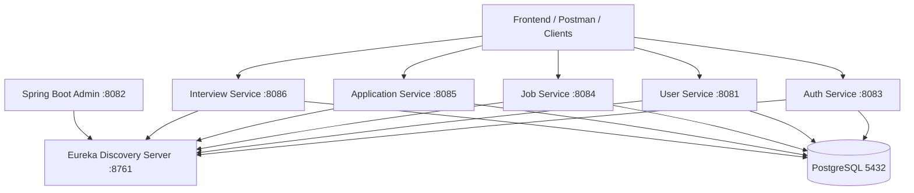

# 366PI Recruitment Platform - Backend Microservices

Production-grade, distributed microservices architecture for the **366PI Recruitment Platform**, built using **Java 17**, **Spring Boot 3.5**, **Spring Cloud 2025 (Eureka)**, **Spring Boot Admin**, **PostgreSQL**, and **OpenAPI (Swagger)**.

---

## Architecture Overview



### Services & Port Mapping

| Service | Port | Database | Swagger / OpenAPI UI | Description |
|---|---|---|---|---|
| **Discovery Server** | `8761` | — | [Dashboard](http://localhost:8761) | Netflix Eureka service discovery & registry |
| **Admin Server** | `8082` | — | [Admin UI](http://localhost:8082) | Spring Boot Admin monitoring & health console |
| **Auth Service** | `8083` | `auth_db` | [Swagger UI](http://localhost:8083/swagger-ui.html) | JWT Auth, Registration, Login, Token Rotation, Password Reset |
| **User Service** | `8081` | `user_db` | [Swagger UI](http://localhost:8081/swagger-ui.html) | Candidate profiles, skills, bios, and account data |
| **Job Service** | `8084` | `job_db` | [Swagger UI](http://localhost:8084/swagger-ui.html) | Job requisitions, lifecycle (Draft/Publish/Pause/Close), filters |
| **Application Service** | `8085` | `application_db` | [Swagger UI](http://localhost:8085/swagger-ui.html) | Job submissions, candidate applications, status workflow |
| **Interview Service** | `8086` | `interview_db` | [Swagger UI](http://localhost:8086/swagger-ui.html) | Interviewers, slot booking, scheduling & status lifecycle |

---

## Prerequisites & Requirements

To run this backend locally on any developer machine (Windows, macOS, or Linux), ensure the following are installed:

1. **Java Development Kit (JDK)**: **Java 17 or Java 21** (Eclipse Temurin / OpenJDK recommended).
   - Check with: `java -version`
2. **Docker & Docker Compose**: For running the PostgreSQL databases.
   - Check with: `docker --version` and `docker compose version`
   - *(Optional: If not using Docker, install local PostgreSQL 15+ on port 5432 with password `postgrespassword`)*.
3. **Maven**: Maven Wrapper (`mvnw` / `mvnw.cmd`) is pre-bundled in the repository. No separate Maven installation required!
4. **Postman**: For running the complete endpoint test suite (`collection.json`).
5. **IDE (Optional)**: Spring Tool Suite 4 (STS) or IntelliJ IDEA.
   - *Note for STS / Eclipse users*: Lombok agent must be installed into STS to compile without errors (see [Troubleshooting](#sts--eclipse-lombok-setup)).

---

## Step-by-Step Setup & Running Guide

Follow these steps in exact order to bring up the system cleanly:

### Step 1: Clone the Repository

```bash
git clone https://github.com/sanchikumar12/Recruiter_Backend.git
cd Recruiter_Backend
```

---

### Step 2: Start PostgreSQL Database

Start the pre-configured multi-database PostgreSQL container using Docker Compose:

```bash
docker compose up -d
```

This automatically initializes the 5 service databases:
- `auth_db`
- `user_db`
- `job_db`
- `application_db`
- `interview_db`

*(Optional pgAdmin interface is available at `http://localhost:5050` with email `admin@366pi.com` and password `adminpassword`)*.

---

### Step 3: Build All Microservices

Run the Maven wrapper from the root repository folder:

- **Windows**:
  ```cmd
  mvnw.cmd clean test-compile -DskipTests
  ```
- **macOS / Linux**:
  ```bash
  chmod +x mvnw
  ./mvnw clean test-compile -DskipTests
  ```

---

### Step 4: Launch Microservices

#### Option A: 1-Click Launchers (Windows)
- **Start Core Services Only (Discovery, Admin, Auth, User)**:
  Double-click or run:
  ```cmd
  start-core-services.bat
  ```
- **Start All 7 Services**:
  Double-click or run:
  ```cmd
  start-all-services.bat
  ```
- **Stop All Running Services**:
  ```cmd
  stop-all-services.bat
  ```

#### Option B: Launch Manually / Cross-Platform (Terminal)
Launch each service in a separate terminal tab in this order:

1. **Discovery Server (Port 8761)** *(Wait 10-15 seconds for Eureka to initialize)*:
   ```bash
   cd discovery-server && ../mvnw spring-boot:run
   ```
2. **Admin Server (Port 8082)**:
   ```bash
   cd admin-server && ../mvnw spring-boot:run
   ```
3. **Auth Service (Port 8083)**:
   ```bash
   cd auth-service && ../mvnw spring-boot:run
   ```
4. **User Service (Port 8081)**:
   ```bash
   cd user-service && ../mvnw spring-boot:run
   ```
5. **Job Service (Port 8084)**:
   ```bash
   cd job-service && ../mvnw spring-boot:run
   ```
6. **Application Service (Port 8085)**:
   ```bash
   cd application-service && ../mvnw spring-boot:run
   ```
7. **Interview Service (Port 8086)**:
   ```bash
   cd interview-service && ../mvnw spring-boot:run
   ```

---

## API Testing with Postman (`collection.json`)

A comprehensive, fully automated Postman collection is included in the project root:
**`collection.json`**

### How to Import & Run:
1. Open **Postman**.
2. Click **Import** (or press `Ctrl + O`).
3. Drag and drop **`collection.json`** from the root folder.
4. The collection covers **79 requests across all 7 services**.
5. Click **"Run Collection"**:
   - The test scripts automatically chain responses, capturing JWT access tokens, candidate IDs, job IDs, application IDs, and interview IDs into collection variables.

---

## Key API Endpoints Reference

### 🔐 Auth Service (`http://localhost:8083`)
- `POST /api/v1/auth/register` — Register new user account (`email`, `password`, `role`).
- `POST /api/v1/auth/activate` — Confirm activation token & set initial password.
- `POST /api/v1/auth/login` — Login with email/password; returns `accessToken` and `refreshToken`.
- `POST /api/v1/auth/refresh` — Rotate refresh token and obtain new JWT access token.
- `POST /api/v1/auth/forgot-password` — Generate a 15-minute password reset token.
- `POST /api/v1/auth/reset-password` — Submit reset token and new password.
- `POST /api/v1/auth/logout` — Revoke refresh token and terminate active session.

### 👤 User Service (`http://localhost:8081`)
- `POST /api/v1/users` (or `/api/candidates`) — Register candidate profile (`fullName`, `email`, `skills`, `mobileNumber`, `location`, `headline`, `bio`).
- `GET /api/v1/users/{id}` (or `/api/candidates/{id}`) — Fetch candidate profile by UUID.

### 💼 Job Service (`http://localhost:8084`)
- `POST /api/v1/admin/jobs` — Admin create job (DRAFT status).
- `POST /api/v1/admin/jobs/{jobId}/publish` — Transition job to PUBLISHED.
- `POST /api/v1/admin/jobs/{jobId}/pause` — Pause published job.
- `POST /api/v1/admin/jobs/{jobId}/close` — Permanently close job.
- `GET /api/v1/admin/jobs/stats` — Job metrics and status counts.
- `GET /api/v1/jobs` — Public search and filter published jobs for candidates.

### 📝 Application Service (`http://localhost:8085`)
- `POST /api/v1/applications` — Submit candidate application (`jobId`, `resumeUrl`, `coverNote`).
- `GET /api/v1/applications/my-applications` — Candidate views submitted applications.
- `PUT /api/v1/admin/applications/{id}/status` — Move status (`UNDER_REVIEW`, `SHORTLISTED`, `HIRED`, `REJECTED`).

### 📅 Interview Service (`http://localhost:8086`)
- `POST /api/v1/admin/interviewers` — Register interviewer profile.
- `POST /api/v1/admin/interviews/slots` — Define interview slots for interviewers.
- `GET /api/v1/interviews/slots?applicationId={id}` — Available slots for shortlisted application.
- `POST /api/v1/interviews` — Candidate schedules interview slot.
- `PATCH /api/v1/admin/interviews/{id}/status` — Update interview status (`CONFIRMED`, `COMPLETED`, `NO_SHOW`).

---

## Troubleshooting Guide

### STS / Eclipse: Lombok Setup
If STS displays errors like `"The method getId() is undefined for type..."`:
1. STS requires the Lombok Java Agent. Run your local Lombok jar:
   ```cmd
   java -jar %USERPROFILE%\.m2\repository\org\projectlombok\lombok\<version>\lombok-<version>.jar
   ```
2. Select your `SpringToolSuite4.exe` installation directory.
3. Click **Install / Update**.
4. Restart STS with the `-clean` flag.

### STS / Eclipse: Import Instructions
1. Choose **File** $\rightarrow$ **Import...** $\rightarrow$ **Maven** $\rightarrow$ **Existing Maven Projects**.
2. Select the repository root folder.
3. Select **all 8 `pom.xml` files** and click **Finish**.
4. Select all imported projects $\rightarrow$ Right click $\rightarrow$ **Maven** $\rightarrow$ **Update Project...** $\rightarrow$ Check **"Force Update of Snapshots/Releases"**.

### Port Conflicts
If a port is in use (e.g., `8083` or `5432`):
- Run `stop-all-services.bat` or kill the process:
  ```cmd
  netstat -ano | findstr :8083
  taskkill /PID <PID> /F
  ```

---

## Git Workflow & Branching Strategy

- **`main`**: Stable, production-ready release branch.
- **`dev`**: Integration branch for current sprint development.
- **`feature/*`**: Feature branches for new functionality (e.g., `feature/auth-social-login`).
