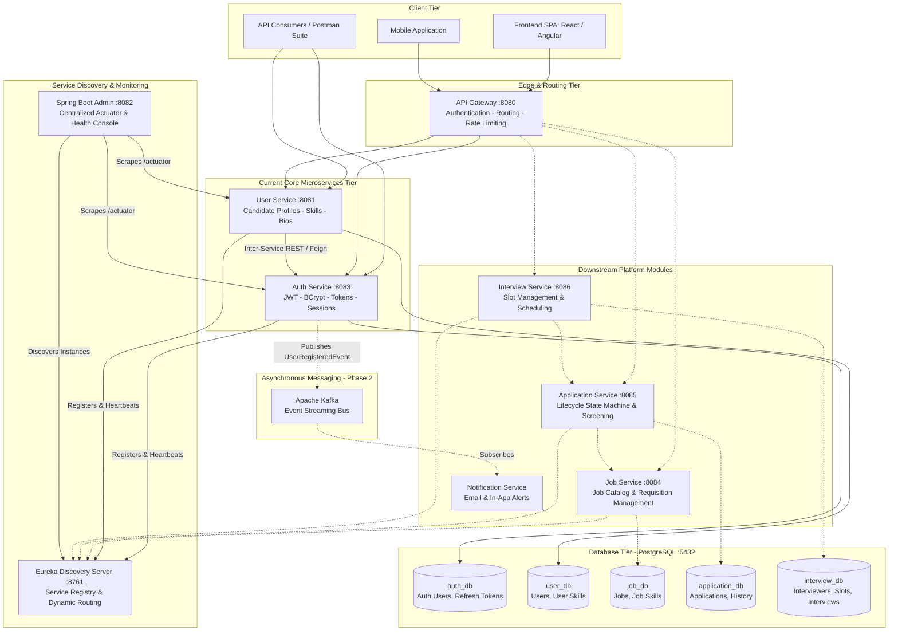
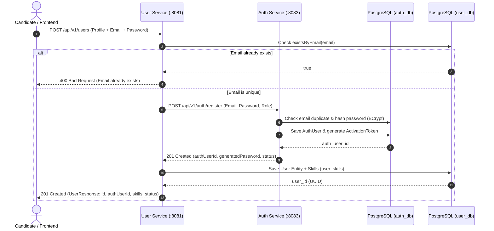
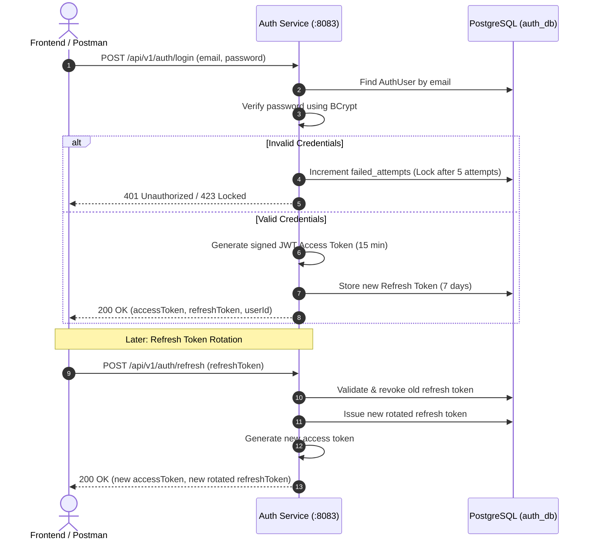
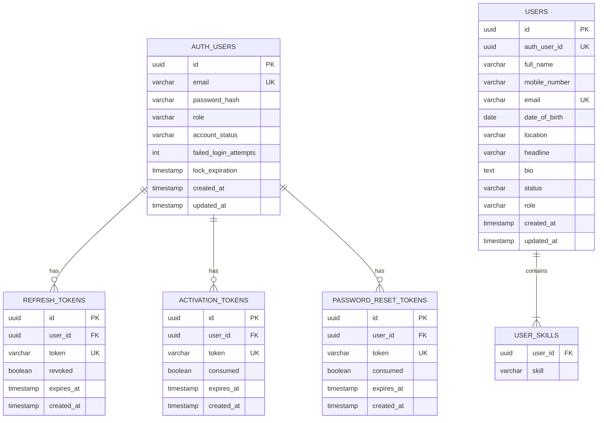

# 366PI Recruitment Platform — Core Backend Microservices

Production-grade, distributed backend microservices architecture for the **366PI Recruitment Platform**, built using **Java 17**, **Spring Boot 3.5**, **Spring Cloud 2025 (Eureka)**, **Spring Boot Admin**, **PostgreSQL**, and **OpenAPI (Swagger)**.

This repository provides the core authentication, user profile management, service discovery, and centralized administrative monitoring needed for frontend integration and end-to-end testing.

---

## 🏛️ Full Architecture Design (HLD & LLD)

### 1. High-Level System Architecture (HLD)

The system is designed following the **Microservices Architecture Pattern** and the **Database-per-Service Pattern** to ensure high cohesion, loose coupling, independent scalability, and fault tolerance.



---

### 2. Core Architectural Patterns & Principles

1. **Database-per-Service Pattern**:
   - Each microservice strictly owns its own dedicated database (`auth_db` vs `user_db`).
   - Direct cross-database joins are prohibited; services communicate exclusively through clean REST APIs or asynchronous events.
2. **Service Discovery & Registration (Netflix Eureka)**:
   - Services automatically discover each other via Eureka without hardcoding IP addresses or ports.
   - Heartbeat health checks (every 30s) automatically deregister unhealthy instances.
3. **Centralized Health & Observability (Spring Boot Admin)**:
   - Centrally aggregates Spring Boot Actuator endpoints (`/health`, `/metrics`, `/env`, `/mappings`).
   - Real-time memory, JVM, thread metrics, and log level modifications without service restarts.
4. **Stateless Authentication & Cryptographic Token Architecture**:
   - Short-lived JSON Web Tokens (JWT) signed with HMAC-SHA256 (15-minute expiry).
   - Long-lived, cryptographically random, rotatable Refresh Tokens (7-day expiry) stored in PostgreSQL with immediate revocation capabilities.
   - BCrypt hashing with salt factor 12 for password protection.
5. **Idempotent Database Migrations (Flyway)**:
   - Versioned SQL migration scripts (`V1__...sql`, `V2__...sql`) executed automatically upon container startup to guarantee repeatable, reproducible schema across environments.

---

### 3. Detailed Microservice Workflows (Sequence Diagrams)

#### A. Candidate Registration & Profile Creation Workflow


#### B. User Authentication & Token Rotation Workflow


---

### 4. Entity-Relationship & Database Schema Design (ERD)



---

## 🧭 Services & Port Mapping

| Service | Port | Database | Swagger / OpenAPI UI | Description |
|---|:---:|:---:|:---:|---|
| **Discovery Server** | `8761` | — | [Dashboard](http://localhost:8761) | Netflix Eureka service discovery & instance registry |
| **Admin Server** | `8082` | — | [Admin UI](http://localhost:8082) | Spring Boot Admin monitoring & health console |
| **Auth Service** | `8083` | `auth_db` | [Swagger UI](http://localhost:8083/swagger-ui.html) | JWT Auth, Registration, Login, Token Rotation, Password Reset |
| **User Service** | `8081` | `user_db` | [Swagger UI](http://localhost:8081/swagger-ui.html) | Candidate profiles, skills, bios, and account data |

---

## 📋 Prerequisites & System Requirements

Ensure the following tools are installed before running the project:

1. **Java Development Kit (JDK)**: **Java 17 or Java 21** (Eclipse Temurin / OpenJDK).
   - Verify: `java -version`
2. **Docker Desktop**: For running the PostgreSQL databases.
   - Verify: `docker --version` and `docker compose version`
3. **Maven**: Maven Wrapper (`mvnw` / `mvnw.cmd`) is pre-bundled in this repository. No separate Maven installation is required.
4. **Postman**: To import and execute the automated API suite (`collection.json`).

---

## 🚀 Step-by-Step Setup & Run Guide

Follow these steps in exact order to run the backend:

### Step 1: Clone the Repository

```bash
git clone https://github.com/sanchikumar12/Recruiter_Backend.git
cd Recruiter_Backend
```

---

### Step 2: Start PostgreSQL Database

Run Docker Compose to start PostgreSQL and automatically provision `auth_db` and `user_db`:

```bash
docker compose up -d
```

*(Optional: pgAdmin is available at `http://localhost:5050` with login `admin@366pi.com` / `adminpassword`)*.

---

### Step 3: Compile the Project

From the project root directory, run the Maven wrapper:

- **Windows**:
  ```cmd
  mvnw.cmd clean test-compile -DskipTests
  ```
- **macOS / Linux**:
  ```bash
  chmod +x mvnw
  ./mvnw clean test-compile -DskipTests
  ```

You should see:
```text
[INFO] discovery-server ................................... SUCCESS
[INFO] admin-server ....................................... SUCCESS
[INFO] user-service ....................................... SUCCESS
[INFO] auth-service ....................................... SUCCESS
[INFO] 366pi-parent ....................................... SUCCESS
[INFO] BUILD SUCCESS
```

---

### Step 4: Launch Microservices

#### Method A: 1-Click Launchers (Windows)
- **Start All 4 Services**:
  Double-click or run:
  ```cmd
  start-services.bat
  ```
- **Stop All Running Services**:
  Double-click or run:
  ```cmd
  stop-services.bat
  ```

#### Method B: Manual Launch in Order (Any OS)
Open separate terminal tabs and start each service in this exact order:

1. **Discovery Server (Port 8761)** *(Wait 10-15 seconds for Eureka to start)*:
   ```bash
   cd discovery-server && ../mvnw spring-boot:run
   ```
2. **Admin Server (Port 8082)**:
   ```bash
   cd admin-server && ../mvnw spring-boot:run
   ```
3. **Auth Service (Port 8083)**:
   ```bash
   cd auth-service && ../mvnw spring-boot:run
   ```
4. **User Service (Port 8081)**:
   ```bash
   cd user-service && ../mvnw spring-boot:run
   ```

---

## 🧪 Postman API Testing (`collection.json`)

A complete, automated Postman test collection is provided in the repository root: **`collection.json`**.

### How to Import & Run:
1. Open **Postman**.
2. Click **Import** (or press `Ctrl + O`).
3. Select or drag-and-drop **`collection.json`**.
4. The collection contains all 27 endpoints across the 4 services with pre-configured variables and assertions:
   - **01 - Discovery Server (Eureka :8761)**: Web dashboard, registry, actuator health.
   - **02 - Admin Server (Spring Boot Admin :8082)**: Dashboard UI, instances list, actuator health.
   - **03 - Auth Service (:8083)**: Registration, auto-generated password flow, account activation, login, refresh token rotation, forgot/reset password, logout.
   - **04 - User Service (:8081)**: Candidate profile creation, profile lookup by ID, alias routes (`/api/candidates`), negative tests.
5. Click **Run Collection** $\rightarrow$ All tests run sequentially, auto-extracting JWT tokens and candidate IDs.

---

## 🔌 Core API Endpoints for Frontend Integration

### 🔐 Authentication Service (`http://localhost:8083`)

| Method | Endpoint | Request Body Sample | Description |
|---|---|---|---|
| `POST` | `/api/v1/auth/register` | `{"email": "user@example.com", "password": "Password123!", "role": "USER"}` | Register new account with custom password |
| `POST` | `/api/v1/auth/register` | `{"email": "user@example.com", "role": "USER"}` | Register account with server-generated password |
| `POST` | `/api/v1/auth/activate` | `{"token": "<activation-token>", "password": "<new-password>"}` | Activate account using activation token |
| `POST` | `/api/v1/auth/login` | `{"email": "user@example.com", "password": "Password123!"}` | Authenticate; returns `accessToken` & `refreshToken` |
| `POST` | `/api/v1/auth/refresh` | `{"refreshToken": "<refresh-token>"}` | Rotate refresh token; returns fresh access token |
| `POST` | `/api/v1/auth/forgot-password`| `{"email": "user@example.com"}` | Generate 15-minute reset token |
| `POST` | `/api/v1/auth/reset-password` | `{"token": "<reset-token>", "newPassword": "<new-password>"}` | Reset password with token |
| `POST` | `/api/v1/auth/logout` | `{"refreshToken": "<refresh-token>"}` | Revoke refresh token |
| `GET` | `/v3/api-docs` | — | OpenAPI v3 JSON spec |
| `GET` | `/swagger-ui/index.html` | — | Interactive Swagger UI |

### 👤 Candidate Profile / User Service (`http://localhost:8081`)

| Method | Endpoint | Request Body Sample | Description |
|---|---|---|---|
| `POST` | `/api/v1/users` | `{"fullName": "Rahul Sharma", "email": "rahul@example.com", "skills": ["Java", "React"], "mobileNumber": "+91 9999999999", "location": "Bangalore"}` | Create complete candidate profile |
| `GET` | `/api/v1/users/{id}` | — | Retrieve candidate profile by UUID |
| `POST` | `/api/candidates` | Same as `/api/v1/users` | Create candidate profile (route alias) |
| `GET` | `/api/candidates/{id}`| — | Retrieve candidate profile by UUID (alias) |
| `GET` | `/v3/api-docs` | — | OpenAPI v3 JSON spec |
| `GET` | `/swagger-ui/index.html` | — | Interactive Swagger UI |

---

## 🛠️ Troubleshooting Guide

### STS / Eclipse: Lombok Compilation Errors
If STS shows *"The method getId() is undefined for type..."*:
1. STS/Eclipse requires the Lombok Java Agent. Locate your Lombok jar in your `.m2` directory:
   ```cmd
   java -jar %USERPROFILE%\.m2\repository\org\projectlombok\lombok\<version>\lombok-<version>.jar
   ```
2. Select your `SpringToolSuite4.exe` installation directory and click **Install / Update**.
3. Restart STS with the `-clean` flag.
*(Note: `user-service` has been fully updated with explicit standard Java getters/setters/constructors, making it 100% independent of Lombok in STS).*

### STS / Eclipse: Project Import
1. In STS, choose **File** $\rightarrow$ **Import...** $\rightarrow$ **Maven** $\rightarrow$ **Existing Maven Projects**.
2. Browse to the root directory.
3. Select all 5 `pom.xml` files (`/pom.xml`, `/discovery-server/pom.xml`, `/admin-server/pom.xml`, `/user-service/pom.xml`, `/auth-service/pom.xml`) and click **Finish**.
4. Select all imported projects $\rightarrow$ Right click $\rightarrow$ **Maven** $\rightarrow$ **Update Project...** $\rightarrow$ Check **"Force Update of Snapshots/Releases"**.

### Port Conflicts
If a port is already in use:
- Run `stop-services.bat` or find and terminate the process:
  ```cmd
  netstat -ano | findstr :8083
  taskkill /PID <PID> /F
  ```

---

## 🌿 Git Branches

- **`main`**: Production release branch.
- **`dev`**: Sprint integration branch.
- **`feature/core-microservices`**: Core microservices feature branch.
